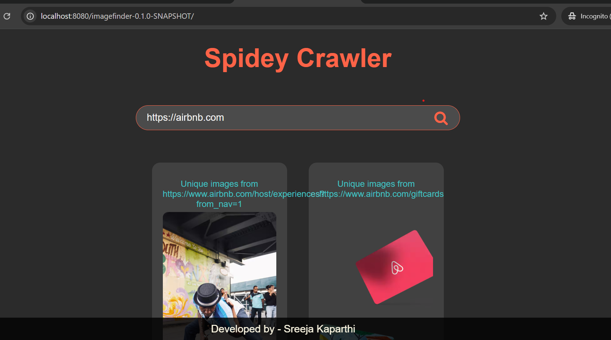

# Multithreaded web crawler using Java

[](https://github.com/thecoderenroute/Image-WebCrawler-servlet)

## ImageFinder Goal

This task's objective is to do a web crawl on a user-provided URL string. You must extract all of the photos from the crawl and provide a JSON array of strings that contain the URLs of each image on the website. The excellent crawling library [Jsoup](https://jsoup.org/) comes pre-installed as a maven.

### Functionality

- Web crawler fetches images from the supplied url
- Identifies the subpages and domain of the url and crawls through them too
- Displays the images crawled from all subpages separately

## Features

Multi-threading is used to streamline the procedure.
Data structures are synchronized to guarantee thread safety for the application.
- Respects the provided domain - Takes into account the possibility that some subpages may have distinct root domains and subdomains
  Crawls the same URL twice; verifies that the URLs are legitimate; and allows for redirects to other parts of the same page.
  Handle unusual circumstances with appropriate error handling and dedicated custom exceptions.

## Tools used

- Java 8
- Java servlets
- Jetty webserver
- JSoup
- HTML, CSS, and Javascript

## Methodology

The core methodology behind this project was recursive job creation to ensure the fastest possible result
while crawling through all possible subpages.

First, a single thread job is created for the source url. The flow of a job is as follows:

- Verify the authenticity of the url
- If authentic, establish a connection and scrape all urls from the webpage
- For each url, check if it belongs to the same domain along with a few other minor checks.
- If the url passes all checks, create a recursive concurrent job for that url and start its execution.
- Once all jobs for the subpages are created, crawl through the url for it's images and add it to an overall set of
  images(to avoid duplication) and add it to a map with the source url as the key.
- Then, the crawler waits for the all sub-jobs it has created to finish and adds the images returned to the map.
- return the map.

This is optimal as it strikes a balance between limiting the number of unnecessary calls and utilizing the full extent
of the hardware available.

## Structure of the project

```
imagefinder
├───src
│   ├───main
│   │   ├───java.com.eulerity.hackathon
│   │   │   └───imagefinder
│   │   │       ├───Exceptions: contains all the custom exception defined from the project
│   │   │       ├───Services
│   │   │       │   ├───ImageCrawlerDelegator.java: delegator for fetching the images
│   │   │       │   └───WebCrawler.java: contains the logic for the recursive jobs
│   │   │       └───Utils
│   │   │            └───Utils.java: conatains regex and String manipulation logic to fetch a url's domain, subdomain and full domain
│   │   └───webapp
│   │       ├───images
│   │       ├───styles.css: CSS for the landing page
│   │       └───index.html: The landing page which also consists of JS to make api calls and process the input
│   └───test
│       └───java.com.eulerity.hackathon
│           └───imagefinder
|               └───ImageFinderTest - contains all the tests
└───target: contains the generated classes and test reports
    
```

The main class is Crawler

## Instructions to test

<code> mvn clean test </code>

## Instructions to run

<code> mvn clean package jetty:run</code>


## Screenshots

